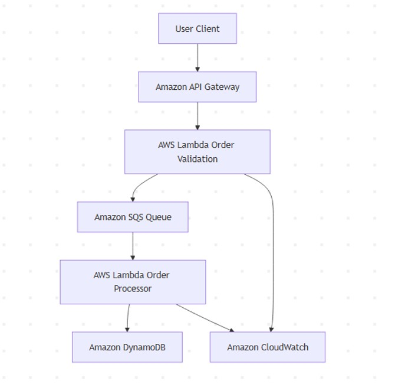
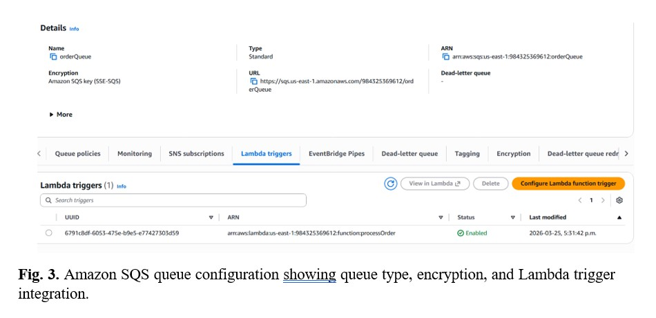
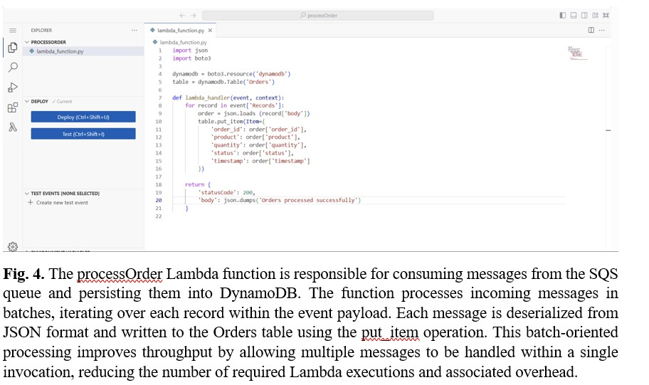
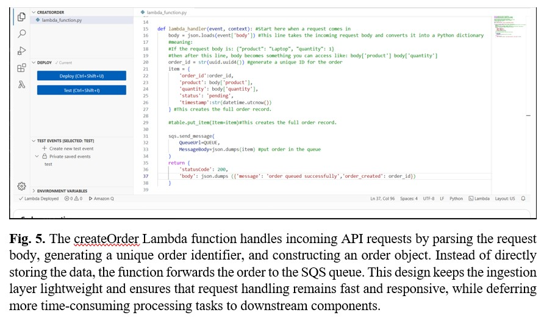
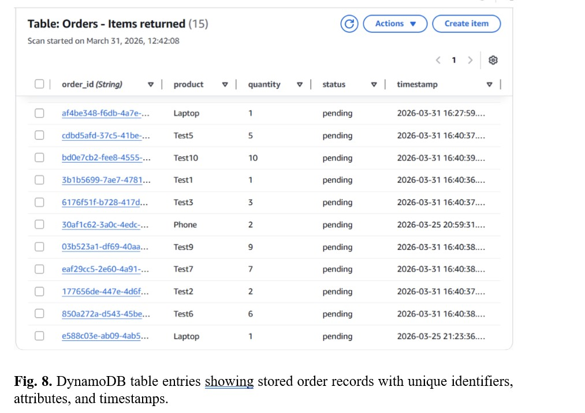
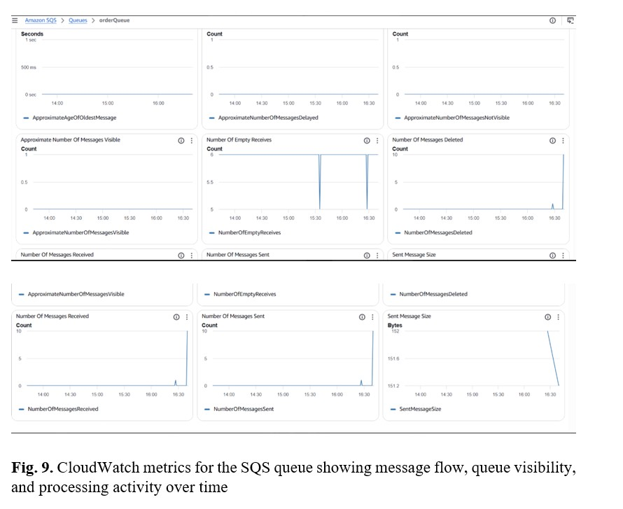

# Event-Driven Order Processing System (AWS)

## Overview

An event-driven system for processing orders asynchronously using AWS services.  
The system decouples request submission from backend processing to handle burst traffic and maintain responsiveness.

---

## Architecture

Flow:
API Gateway → Lambda (createOrder) → SQS → Lambda (processOrder) → DynamoDB

---

## Key design decisions

- Used **SQS** to buffer incoming requests and handle traffic spikes  
- Separated ingestion (`createOrder`) and processing (`processOrder`) for loose coupling  
- Configured **batch processing (10 messages)** to improve throughput  
- Set **visibility timeout (30s)** to prevent duplicate processing during execution  
- Used **DynamoDB (on-demand)** for scalable writes  

---

## Results

- Orders processed successfully under concurrent requests  
- Queue backlog remained near zero  
- Lambda execution time: ~30–80 ms  
- System maintained responsiveness during testing  

---

## Limitations

- No dead-letter queue → failed messages are retried indefinitely  
- No authentication or rate limiting  
- Eventual consistency due to asynchronous processing  

---

## Evidence

---

## Full Report

[View detailed report](docs/report.pdf)
